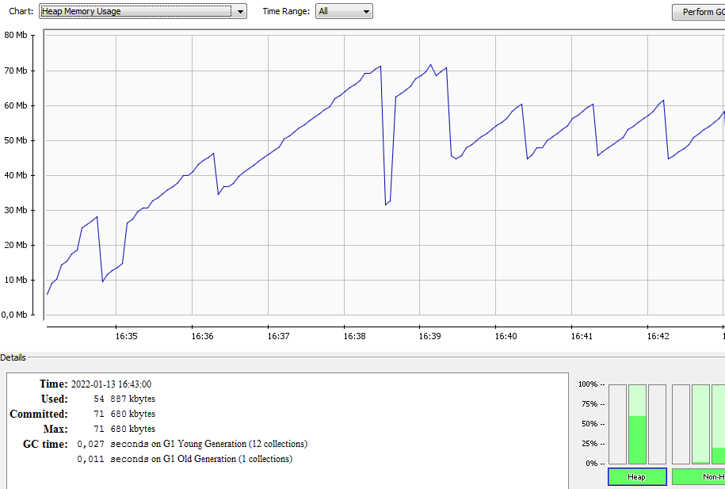
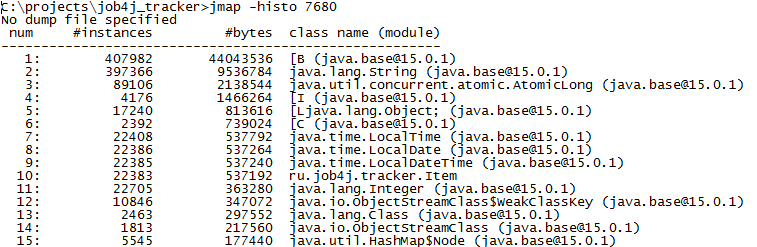
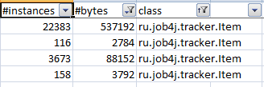
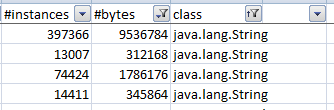
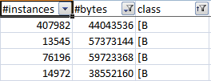
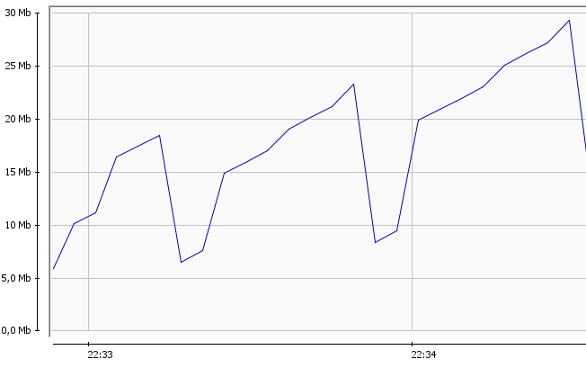

Для более наглядного профилирования трекера был добавлен класс, генерирующий заданное количество операций добавление и 
удаление заявок, и ограничен максимальный размер хипа 70 Мб. После запуска через приложение JConsole видно, как
постепенное заполнение хипа объектами, и периодическая сборка мертвых объектов.

Получив с помощью jmap дамп хипа, видно, что большенство объектов хипа составляют массивы примитивных типов и классы 
String, Item и пакета java.time 

Взяв дамп в разные периоды работы видно как изменяется количестов объектов в зависимости как давно происходила сборка 
мусора
  

Для генерации ошибки OutOfMemoryError размер хипа уменьшен до 30 Мб. Ошибка выходит при приближении использемой памяти
к максимальной
